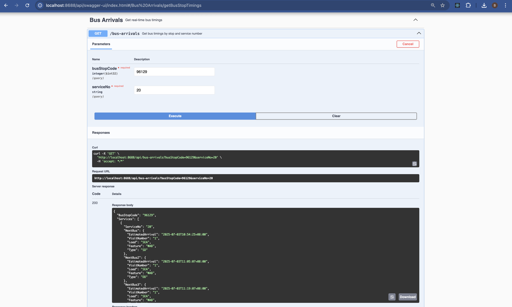

# SG LTA Bus Arrivals API
This Spring Boot project fetches real-time bus arrival data from Singapore's LTA Datamall API and exposes it through clean REST endpoints. It is integrated with OpenAPI (via SpringDoc) and supports AI MCP (Model Configuration Protocol) integration.

## Features

- `/api/bus-arrivals` endpoint to fetch upcoming bus timings by stop and service
- Integration with [LTA Datamall API](https://datamall.lta.gov.sg/)
- `RestTemplate`-based HTTP client
- Swagger/OpenAPI UI at `/swagger-ui.html`
- Clean separation of controller, service, and gateway
- Annotated with `@Schema` for AI tool compatibility
- MCP-friendly OpenAPI structure
- Customizable OpenAPI server URL via properties

---

## 📦 API Usage

**GET /api/bus-arrivals?busStopCode=96129&serviceNo=12**

Returns:
```json
{
  "BusStopCode": "96371",
  "Services": [
    {
      "ServiceNo": "20",
      "NextBus": {
        "EstimatedArrival": "2025-07-03T10:28:06+08:00",
        "Load": "SEA",
        "Feature": "WAB",
        "Type": "DD"
      }
    }
  ]
}
```

# To Run the Application
java -DLTA_API_KEY=your-api-key -jar sg-lta-bus-arrivals-1.0.0-SNAPSHOT.jar

# To Access the openAPI spec
http://localhost:8688/api/v3/api-docs

# To download the openAPI spec in YAML format
http://localhost:8688/api/v3/api-docs.yaml

# To Access the Swagger UI
http://localhost:8688/api/swagger-ui/index.html


# To access health check URL
http://localhost:8688/api/actuator/health